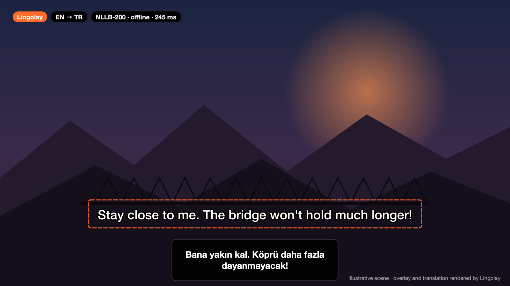
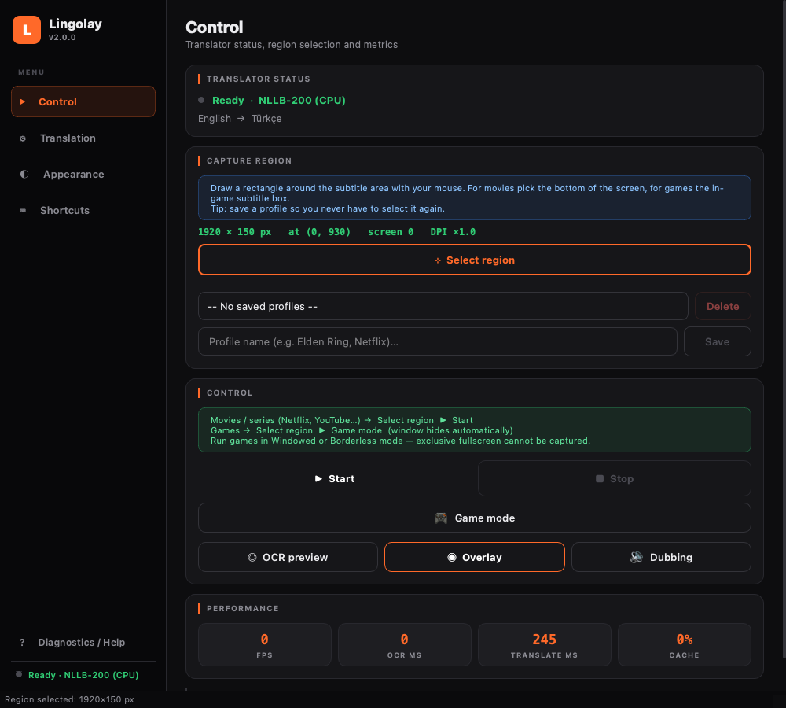
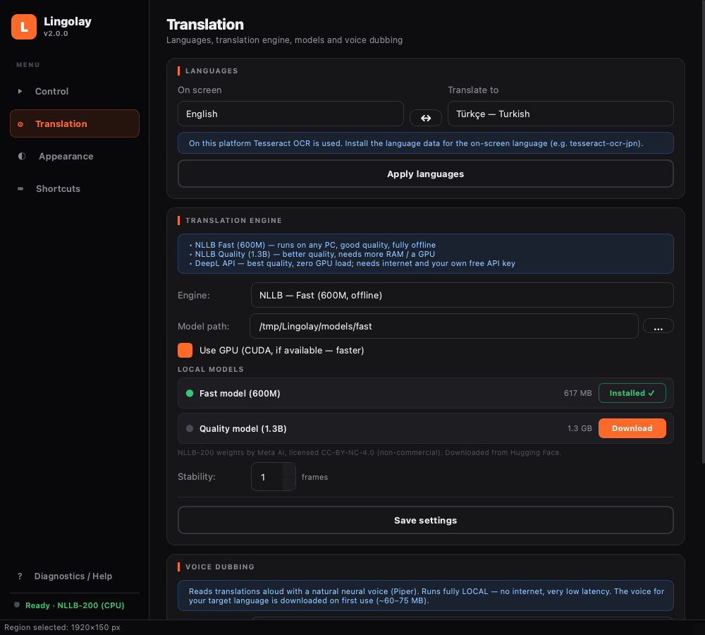
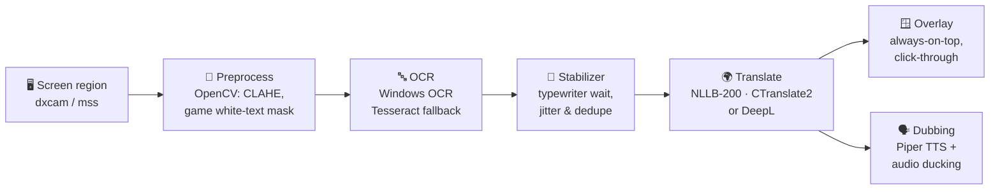

<div align="center">


# Lingolay

**Play any game. Watch any video. In your language — in real time, fully offline.**

Lingolay reads the subtitles on your screen, translates them with Meta's NLLB‑200 neural model running *on your own PC*,<br>
shows the translation in a floating overlay — and can even **dub it out loud** with a natural neural voice.

[](https://github.com/keremss7/lingolay/actions/workflows/ci.yml)
[](https://github.com/keremss7/lingolay/releases/latest)
[](https://github.com/keremss7/lingolay/releases)
[](LICENSE)


[](https://github.com/keremss7/lingolay/stargazers)

[**⬇ Download for Windows**](https://github.com/keremss7/lingolay/releases/latest) · [Quick start](#-quick-start) · [How it works](#-how-it-works) · [Contributing](#-contributing) · [🇹🇷 Türkçe](docs/README.tr.md)



</div>

---

## ✨ Highlights

| | |
|---|---|
| 🔒 **100 % offline & private** | Translation runs locally with [NLLB‑200](https://ai.meta.com/research/no-language-left-behind/) via CTranslate2. No account, no API key, no telemetry — nothing leaves your PC. |
| 🌍 **15 languages, any direction** | English, Japanese, Chinese, Korean, Russian, German, French, Spanish, Portuguese, Italian, Dutch, Polish, Ukrainian, Arabic, Turkish. Pick *on‑screen* → *target* freely. |
| 🎮 **Built for games** | Game mode (auto‑borderless), click‑through always‑on‑top overlay, global hotkeys that work in‑game, white‑text subtitle isolation. |
| 🗣️ **Neural voice dubbing** | Hear translations read aloud with [Piper](https://github.com/rhasspy/piper) voices — also offline — while other apps are automatically ducked. |
| 🧠 **Smart subtitle handling** | Waits for typewriter‑style subtitles to finish, ignores OCR flicker, never re‑translates a line it already showed, and never reads its own overlay. |
| ⚡ **Fast** | ~150–250 ms per sentence on a regular CPU, faster with an NVIDIA GPU. Adaptive capture rate keeps CPU usage low. |
| 🧩 **Optional DeepL** | Bring your own free DeepL API key for maximum quality with zero GPU load. |
| 🎨 **Fully customizable** | Font, size, colors, outline or box, width, position, per‑game capture profiles, rebindable hotkeys. English & Turkish UI. |

## 🖼️ Screenshots

<div align="center">
 
</div>

## 🚀 Quick start

### Option A — Windows app (no Python needed)

1. Download **`Lingolay-…-windows-x64.zip`** from the [latest release](https://github.com/keremss7/lingolay/releases/latest) and extract it.
2. Run **`Lingolay.exe`**. On first launch pick a translation model — it is downloaded once from Hugging Face (~620 MB for *Fast*, ~1.3 GB for *Quality*).
3. Click **Select region**, draw a box around the subtitles, press **Start** (or `Ctrl+Alt+S`). That's it.

> SmartScreen may warn about an unsigned app → **More info → Run anyway**. If the model fails to load, install the [VC++ Redistributable](https://aka.ms/vs/17/release/vc_redist.x64.exe).

### Option B — Install with pip

```bash
pip install "lingolay[all] @ git+https://github.com/keremss7/lingolay"
lingolay
```

### Option C — Run from source

```bash
git clone https://github.com/keremss7/lingolay.git
cd lingolay
python -m venv .venv && .venv\Scripts\activate      # Linux/macOS: source .venv/bin/activate
pip install -e ".[all]"
lingolay                                             # or: python -m lingolay
```

**Download models from the command line** (handy for offline machines or scripts):

```bash
lingolay --list-models
lingolay --download fast voice:tr      # translation model + Turkish dubbing voice
```

<details>
<summary><b>Where are models stored? Can I use a portable/offline setup?</b></summary>

- Models live in `%LOCALAPPDATA%\Lingolay\models` (Windows), `~/Library/Application Support/Lingolay` (macOS) or `~/.local/share/Lingolay` (Linux). Set `LINGOLAY_HOME` to use any other folder (e.g. a USB stick).
- For a fully portable build put a `models/fast/` folder (containing `model.bin`, `tokenizer.json`, …) next to `Lingolay.exe`.
- Behind a firewall? Set `LINGOLAY_HF_ENDPOINT` to a Hugging Face mirror.
- Every file is pinned to an exact Hugging Face commit and verified with SHA‑256.
</details>

## 🎯 Tips for the best results

- **Games:** run them in *Windowed* or *Borderless* mode (exclusive fullscreen can't be captured), then use **🎮 Game mode** — it applies a white‑text subtitle filter and hides the main window (`Ctrl+Alt+W` brings it back).
- **Movies & series:** select only the subtitle strip at the bottom — a smaller region is faster and more accurate.
- **Calibrate** with **OCR preview**: it shows the raw recognized text without translating.
- **Save a profile** per game/platform so you never have to select the region again.
- **Windows OCR language packs:** to read Japanese, Chinese, Korean, … install that language in *Settings → Time & Language → Language* (with *Optical character recognition*).

## ⌨️ Default shortcuts

| Action | Shortcut | Action | Shortcut |
|---|---|---|---|
| Start / Stop | `Ctrl+Alt+S` | OCR preview | `Ctrl+Alt+P` |
| Select region | `Ctrl+Alt+R` | Show/hide window | `Ctrl+Alt+W` |
| Show/hide overlay | `Ctrl+Alt+O` | Game mode | `Ctrl+Alt+G` |
| Dubbing on/off | `Ctrl+Alt+D` | | |

All shortcuts can be rebound in the app.

## 🧠 How it works



- A capture thread grabs only your region; if the picture hasn't changed, OCR is skipped entirely.
- The stabilizer learns whether a source shows subtitles *all at once* or *letter by letter*, and waits just long enough.
- Sentences already translated are dropped from scrolling subtitles, so each line is translated (and spoken) exactly once.

<details>
<summary><b>Project layout</b></summary>

```
src/lingolay/
├── app.py              # entry point, CLI (--download, --list-models)
├── languages.py        # the single table of supported languages
├── capture/            # screen capture thread + region selector
├── preprocessing/      # OpenCV filters (presets for streaming / games)
├── ocr/                # Windows OCR (WinRT), Tesseract fallback
├── text/               # OCR cleanup, subtitle stabilizer, Turkish post-processing
├── translation/        # NLLB (CTranslate2) and DeepL engines + LRU cache
├── tts/                # Piper dubbing engine, loudness boost, audio ducking
├── overlay/            # the translucent subtitle window
├── models/             # pinned model manifest + resumable, verified downloader
├── i18n/               # UI translations (locales/*.json)
└── ui/                 # main window, setup wizard, dialogs
```
</details>

## 🗺️ Roadmap

- [ ] Global hotkeys & click‑through on Linux/macOS
- [ ] More UI languages (community — [it's one JSON file](CONTRIBUTING.md#-translate-the-interface))
- [ ] More translation languages (NLLB supports 200!)
- [ ] Per‑game preprocessing presets shared by the community
- [ ] Translation history window & export
- [ ] Local LLM post‑editing (optional)

Have an idea? [Open a discussion](https://github.com/keremss7/lingolay/discussions).

## 🤝 Contributing

Contributions of every size are welcome — code, translations, bug reports, game presets, or just a ⭐.
Start with [CONTRIBUTING.md](CONTRIBUTING.md) and look for [`good first issue`](https://github.com/keremss7/lingolay/labels/good%20first%20issue).

```bash
pip install -e ".[dev]"
pytest            # tests run headless, no models needed
ruff check src tests
```

## ❓ FAQ

<details><summary><b>Is it really free? Do I need an account or API key?</b></summary>
Yes, and no. Everything runs locally. DeepL is optional and uses your own key.
</details>
<details><summary><b>Does it work with anti‑cheat games?</b></summary>
Lingolay only captures the screen like a screenshot tool; it never reads or modifies game memory. Still, use it at your own discretion.
</details>
<details><summary><b>Which GPU do I need?</b></summary>
None. The Fast model runs well on CPU. With an NVIDIA GPU + CUDA, tick “Use GPU” for lower latency.
</details>
<details><summary><b>Does it work on Linux/macOS?</b></summary>
The app runs (Tesseract is used for OCR), but global hotkeys, game mode and audio ducking are Windows‑only for now. Help wanted!
</details>

## 📜 License

Lingolay is free software licensed under the [GNU GPL v3](LICENSE).

Models are **not** part of this repository and are downloaded from their original publishers:
[NLLB‑200](https://huggingface.co/facebook/nllb-200-distilled-600M) by Meta AI is licensed **CC‑BY‑NC‑4.0 (non‑commercial use only)**;
the CTranslate2 conversions are by [JustFrederik](https://huggingface.co/JustFrederik); [Piper voices](https://huggingface.co/rhasspy/piper-voices) have individual licenses listed on their model cards.

## 🙏 Acknowledgements

[Meta AI — NLLB‑200](https://github.com/facebookresearch/fairseq/tree/nllb) · [CTranslate2](https://github.com/OpenNMT/CTranslate2) · [Piper](https://github.com/rhasspy/piper) · [PySide6 / Qt](https://www.qt.io/qt-for-python) · [DXcam](https://github.com/ra1nty/DXcam) · [python-mss](https://github.com/BoboTiG/python-mss) · [OpenCV](https://opencv.org/) · [pycaw](https://github.com/AndreMiras/pycaw)

<div align="center">

**If Lingolay helps you enjoy a game or show you couldn't understand before, please consider giving it a ⭐ — it really helps the project grow.**

[](https://star-history.com/#keremss7/lingolay&Date)

</div>
