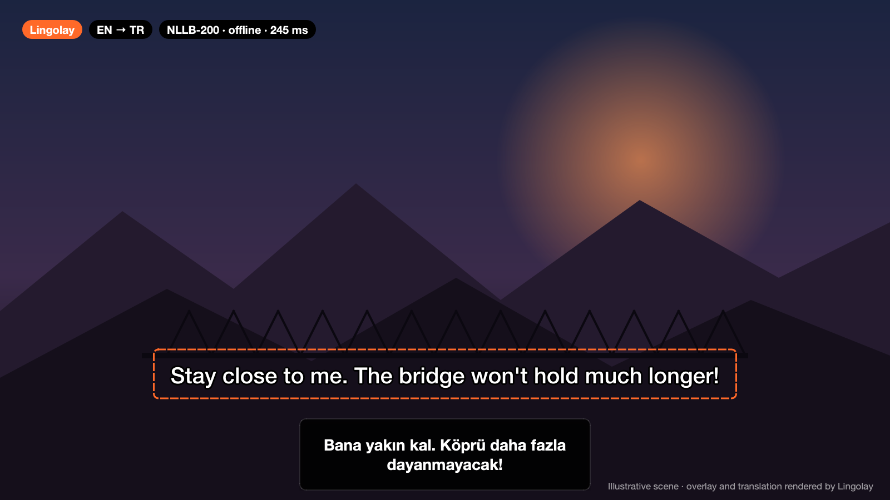
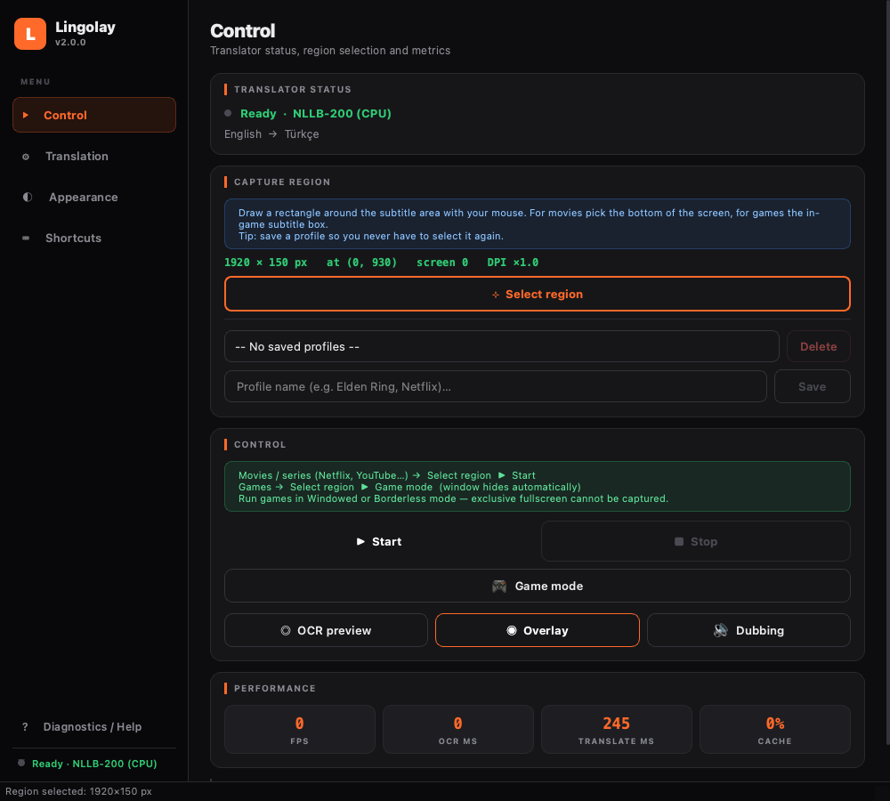
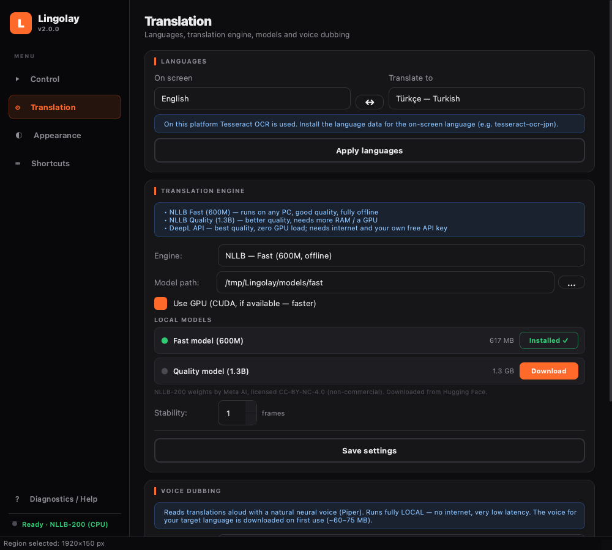

<div align="center">


# Lingolay

**Играйте в любые игры и смотрите любые видео на своём языке — в реальном времени и полностью офлайн.**

Lingolay считывает субтитры с экрана, переводит их нейросетью NLLB‑200 от Meta *прямо на вашем компьютере*,<br>
показывает перевод в плавающем окне поверх игры — и может **озвучить его естественным голосом**.

[**⬇ Скачать для Windows**](https://github.com/keremss7/lingolay/releases/latest) · [🇬🇧 English](../README.md) · [🇹🇷 Türkçe](README.tr.md)



</div>

## ✨ Возможности

- 🔒 **100% офлайн и приватно** — без аккаунта, API-ключей и сбора данных. Перевод выполняется только на вашем компьютере.
- 🌍 **15 языков в любом направлении** — английский, японский, китайский, корейский, русский, немецкий, французский, испанский, португальский, итальянский, нидерландский, польский, украинский, арабский, турецкий. Язык на экране → язык перевода выбираются свободно.
- 🎮 **Создан для игр** — игровой режим (автоматически без рамки), оверлей поверх всех окон, пропускающий клики, глобальные горячие клавиши, работающие в игре.
- 🗣️ **Нейросетевая озвучка** — переводы озвучиваются голосами Piper (тоже офлайн, есть русский голос), а звук игры в это время автоматически приглушается.
- 🧠 **Умное отслеживание субтитров** — ждёт, пока «печатающийся» субтитр допишется, игнорирует мерцание OCR и не переводит одну фразу дважды.
- 🧩 **DeepL по желанию** — максимальное качество с вашим бесплатным ключом DeepL.
- 🇷🇺 **Интерфейс на русском** — язык выбирается автоматически по системе или в *Внешний вид → Интерфейс*.

## 🖼️ Скриншоты

<div align="center">
 
</div>

## 🚀 Быстрый старт

**Приложение для Windows (Python не нужен):**
1. Скачайте `Lingolay-…-windows-x64.zip` из [последнего релиза](https://github.com/keremss7/lingolay/releases/latest) и распакуйте в любую папку.
2. Запустите `Lingolay.exe`. При первом запуске выберите модель перевода — она один раз скачается с Hugging Face (*Быстрая* ~620 МБ, *Качество* ~1,3 ГБ).
3. Нажмите **Выбрать область**, обведите субтитры рамкой и нажмите **Старт** (`Ctrl+Alt+S`). Готово.

> Если появится предупреждение SmartScreen: **Подробнее → Выполнить в любом случае**. Если модель не загружается, установите [VC++ Redistributable](https://aka.ms/vs/17/release/vc_redist.x64.exe).

**Через Python:**

```bash
git clone https://github.com/keremss7/lingolay.git
cd lingolay
python -m venv .venv && .venv\Scripts\activate
pip install -e ".[all]"
lingolay
```

**Скачать модели из командной строки:**

```bash
lingolay --list-models
lingolay --download fast voice:ru     # модель перевода + русский голос для озвучки
```

## 🎯 Советы

- **Игры:** запускайте игру в *оконном* режиме или *без рамки* (эксклюзивный полноэкранный режим захватить нельзя), затем включите **🎮 Игровой режим**. Главное окно возвращается сочетанием `Ctrl+Alt+W`.
- **Фильмы и сериалы:** выделяйте только полосу субтитров внизу — маленькая область работает быстрее и точнее.
- Настройте область через **Предпросмотр OCR**: он показывает распознанный текст без перевода.
- **Сохраняйте профиль** для каждой игры или платформы.
- Чтобы читать японский, китайский, корейский и другие языки, добавьте этот язык в Windows (*Параметры → Время и язык → Язык*, с «Оптическим распознаванием символов»).

## 🤝 Участие

Мы рады любой помощи: код, перевод интерфейса, сообщения об ошибках, пресеты для игр или просто ⭐. Подробности: [CONTRIBUTING.md](../CONTRIBUTING.md) (на английском). Сообщения об ошибках можно писать и на русском.

## 📜 Лицензия

Lingolay — свободное ПО под лицензией [GNU GPL v3](../LICENSE). Модели **не входят** в репозиторий, они скачиваются у оригинальных авторов. NLLB‑200 (Meta AI) распространяется по лицензии **CC‑BY‑NC‑4.0 — только некоммерческое использование**.

<div align="center">

**Если Lingolay вам пригодился, поставьте ⭐ — это действительно помогает проекту расти.**

</div>
