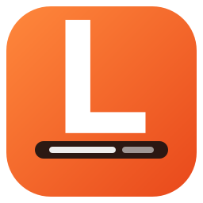
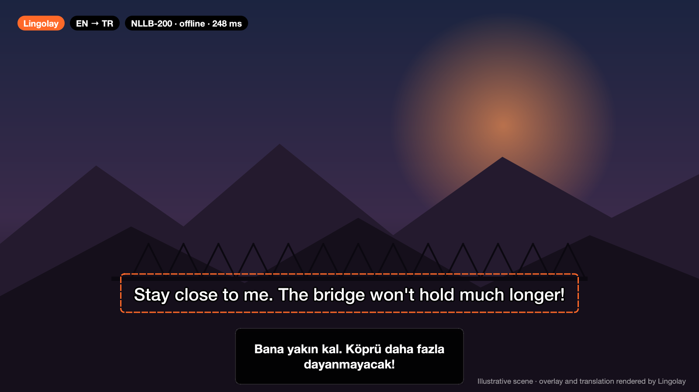
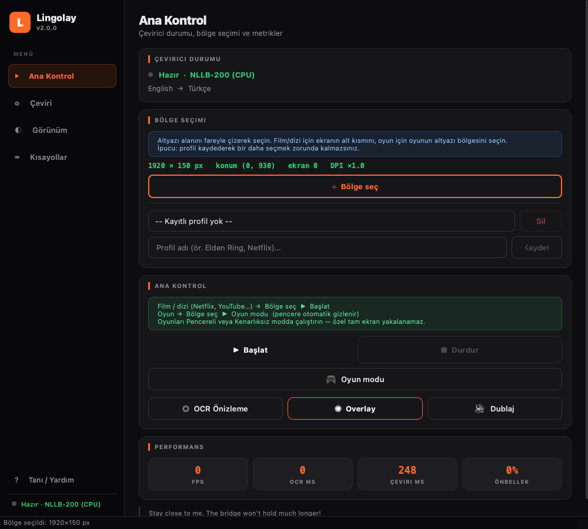
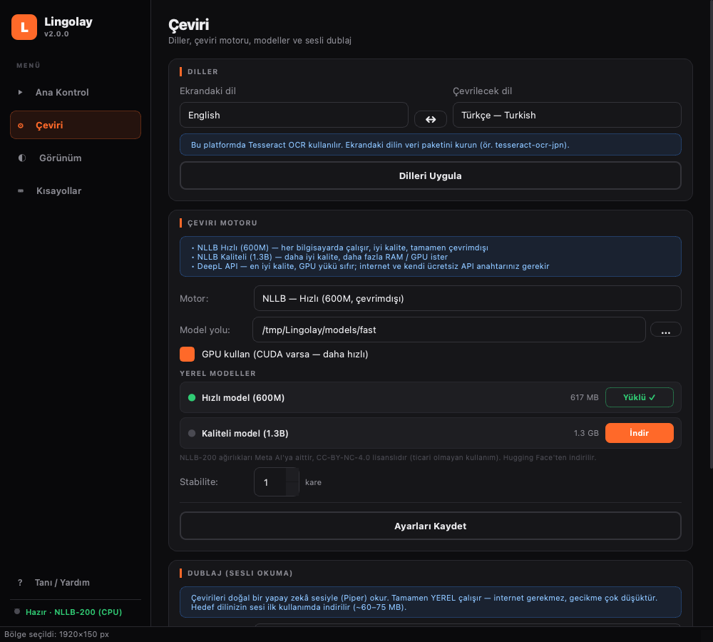

<div align="center">



# Lingolay

**Her oyunu oyna, her videoyu izle — kendi dilinde, gerçek zamanlı ve tamamen çevrimdışı.**

Lingolay ekrandaki altyazıyı okur, Meta'nın NLLB‑200 yapay zekâ modeliyle *kendi bilgisayarında* çevirir,<br>
çeviriyi ekranın üstünde yüzen bir pencerede gösterir — istersen **doğal bir sesle dublaj** da yapar.

[**⬇ Windows için indir**](https://github.com/keremss7/lingolay/releases/latest) · [🇬🇧 English](../README.md)



</div>

## ✨ Öne çıkanlar

- 🔒 **%100 çevrimdışı ve gizli** — hesap, API anahtarı veya veri toplama yok. Çeviri tamamen senin bilgisayarında yapılır.
- 🌍 **15 dil, her yöne** — İngilizce, Japonca, Çince, Korece, Rusça, Almanca, Fransızca, İspanyolca, Portekizce, İtalyanca, Felemenkçe, Lehçe, Ukraynaca, Arapça, Türkçe. Ekrandaki dil → hedef dil serbest.
- 🎮 **Oyunlar için tasarlandı** — oyun modu (otomatik borderless), tıklamayı geçiren ve her zaman üstte kalan overlay, oyun içinde çalışan kısayollar.
- 🗣️ **Yapay zekâ dublaj** — çeviriler Piper sesleriyle (yine çevrimdışı) seslendirilir, bu sırada oyunun sesi otomatik kısılır.
- 🧠 **Akıllı altyazı takibi** — harf harf yazılan altyazının bitmesini bekler, OCR titremesini yok sayar, aynı cümleyi iki kez çevirmez.
- 🇹🇷 **Türkçeye özel son işlem** — i/İ büyük harf kuralları, efekt etiketleri ([LAUGHING] → [GÜLÜYOR]), tekrar temizliği.
- 🧩 **İsteğe bağlı DeepL** — kendi ücretsiz DeepL anahtarınla en yüksek kalite.

## 🖼️ Ekran görüntüleri

<div align="center">
 
</div>

## 🚀 Hızlı başlangıç

**Windows uygulaması (Python gerekmez):**
1. [Son sürümden](https://github.com/keremss7/lingolay/releases/latest) `Lingolay-…-windows-x64.zip` dosyasını indir ve bir klasöre çıkar.
2. `Lingolay.exe`'yi çalıştır. İlk açılışta bir çeviri modeli seç — Hugging Face'ten bir kez indirilir (*Hızlı* ~620 MB, *Kaliteli* ~1,3 GB).
3. **Bölge seç** ile altyazının etrafına bir kutu çiz, **Başlat**'a bas (`Ctrl+Alt+S`). Hepsi bu.

> SmartScreen uyarısında **Ek bilgi → Yine de çalıştır**. Model yüklenmezse [VC++ Redistributable](https://aka.ms/vs/17/release/vc_redist.x64.exe) kur.

**Python ile:**

```bash
git clone https://github.com/keremss7/lingolay.git
cd lingolay
python -m venv .venv && .venv\Scripts\activate
pip install -e ".[all]"
lingolay
```

**Modelleri komut satırından indir:**

```bash
lingolay --list-models
lingolay --download fast voice:tr     # çeviri modeli + Türkçe dublaj sesi
```

## 🎯 İpuçları

- **Oyunlar:** oyunu *Pencereli* veya *Kenarlıksız (Borderless)* modda çalıştır (özel tam ekran yakalanamaz), sonra **🎮 Oyun modu**'nu kullan. Ana pencere `Ctrl+Alt+W` ile geri gelir.
- **Film/dizi:** yalnızca alttaki altyazı şeridini seç — küçük bölge daha hızlı ve isabetlidir.
- **OCR Önizleme** ile bölgeyi ayarla: ham tanınan metni çevirmeden gösterir.
- Her oyun/platform için **profil kaydet**.
- Japonca, Çince, Korece… okumak için Windows'a o dili ekle (*Ayarlar → Saat ve Dil → Dil*, “Optik karakter tanıma” ile).

## 🤝 Katkı

Her türlü katkıya açığız: kod, arayüz çevirisi, hata bildirimi, oyun ön ayarları ya da bir ⭐. Ayrıntılar: [CONTRIBUTING.md](../CONTRIBUTING.md).

## 📜 Lisans

Lingolay, [GNU GPL v3](../LICENSE) lisanslı özgür yazılımdır. Modeller bu depoda **bulunmaz**; orijinal yayıncılarından indirilir. NLLB‑200 (Meta AI) **CC‑BY‑NC‑4.0 — yalnızca ticari olmayan kullanım** lisanslıdır.

<div align="center">

**Lingolay işine yaradıysa bir ⭐ bırakmayı unutma — projenin büyümesine gerçekten yardım ediyor.**

</div>
